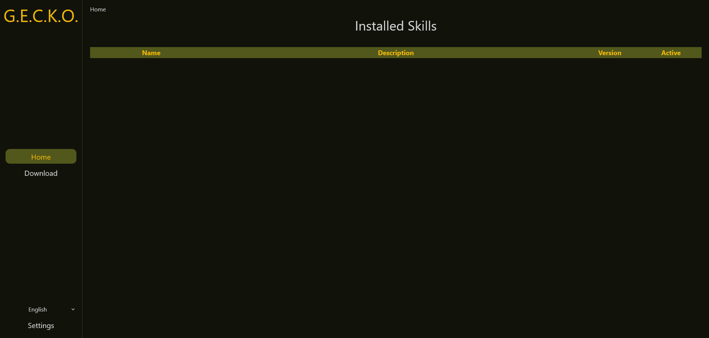
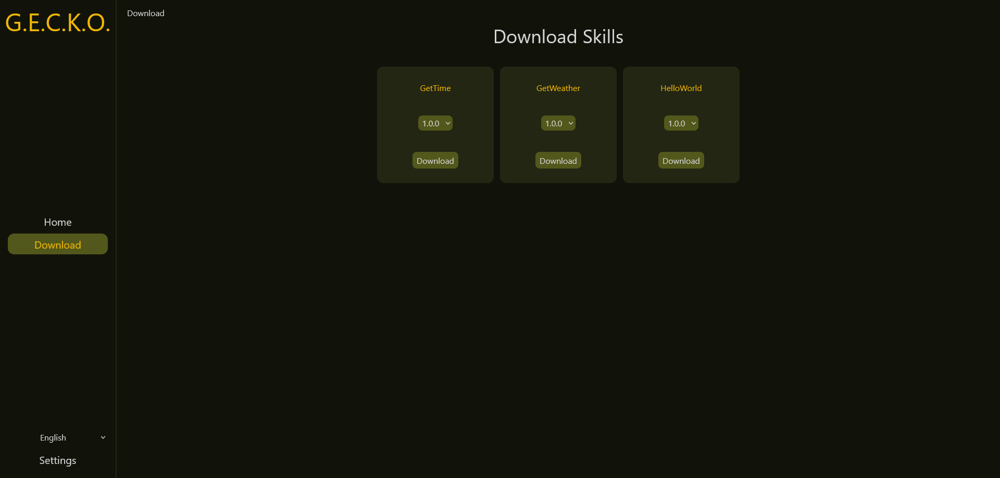
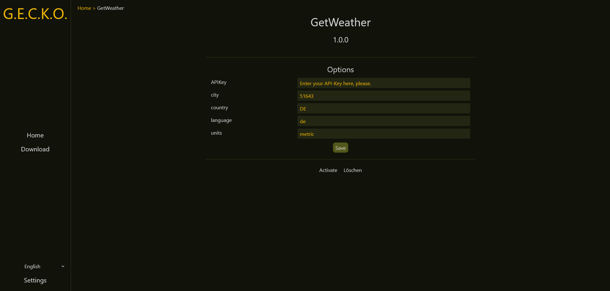
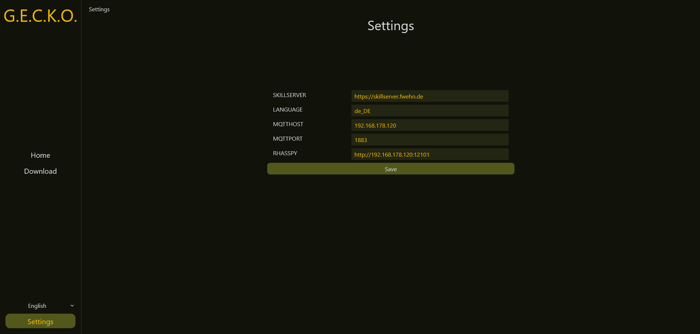

At the beginning you land on the "Home" page.  
Here you will find a list of all currently installed skills.  
You can select them to get more information or to activate them.

## Download new skills

On the "Download" page you can download new skills from skillserver.  

To do this, you need to click on "Download" on the left, choose a skill, select the desired version and click on "Download" again below.  
The "Download" button should now be grayed out and the skill should be found again on the "Home" page.  

## Skill Details

To activate a skill, select it on the "Home" page.  
An overview page of the skill will open.  
On this page you can specify options for the skill.  
You can also deactivate/activate and delete the skill.  

## Change settings

Auf der "Settings" Seite lassen sich einstellungen für den Skillmanager ändern.    
Darunter fallen beispielsweise die Pfade zu Rhasspy, dem MQTT-Broker oder dem Skillserver.  

